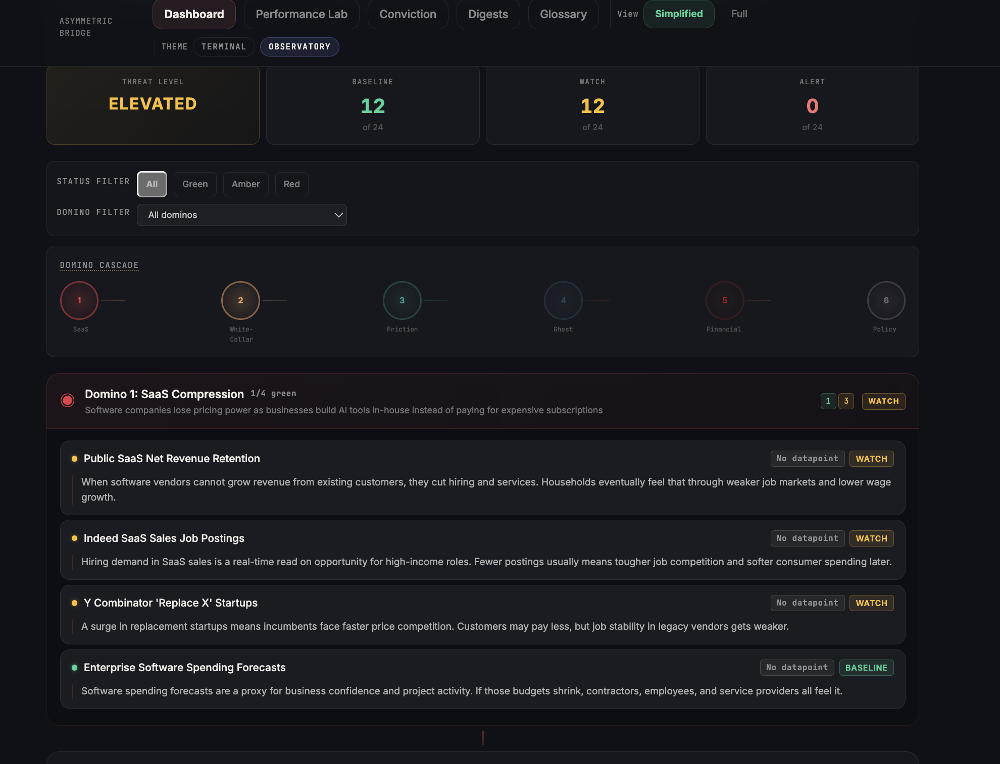

<p align="center">
  
</p>

<h1 align="center">Asymmetric Bridge</h1>

<p align="center">
  <strong>Track the AI macro theses that are moving markets — against your career and your portfolio.</strong>
</p>

<p align="center">
  <a href="https://github.com/thelucidbox/AsymmetricBridge/stargazers"></a>
  <a href="./LICENSE"></a>
  <a href="https://github.com/thelucidbox/AsymmetricBridge/issues"></a>
</p>

<p align="center">
  <a href="#quickstart">Quickstart</a> &middot;
  <a href="#features">Features</a> &middot;
  <a href="#how-it-works">How It Works</a> &middot;
  <a href="./CONTRIBUTING.md">Contributing</a>
</p>

---

There are thought pieces right now that are genuinely moving markets — [The 2028 Global Intelligence Crisis](https://www.citriniresearch.com/p/the-2028-global-intelligence-crisis) by Citrini & Alap Shah, the [Leopold Aschenbrenner situational awareness](https://situational-awareness.ai/) essays, the [Bull Rebuttal](https://www.theatlantic.com/technology/archive/2024/01/ai-optimism-economy/677061/). Big claims about where AI and the economy are headed.

Asymmetric Bridge is a project that helps you track these theses against real economic data — and see how they might affect your professional life and your investments. Define a thesis as a chain of dominos, connect each one to live signals, upload your portfolio, and see what's actually moving.

Not investment advice. Not a platform. Just an open source tool born from reading too many macro research papers and wanting a structured way to follow the answers.

No black boxes. No subscriptions. Clone it, run it yourself. Your API keys stay in your browser.

## Quickstart

```bash
git clone https://github.com/thelucidbox/AsymmetricBridge.git
cd AsymmetricBridge
npm install
cp .env.example .env   # Add your API keys (all free tier)
npm run dev
```

Open `http://localhost:5173` and the onboarding wizard walks you through setup in about 3 minutes.

## Features

### Thesis Framework — The 6-Domino Cascade


Define your macro thesis as a chain of cause-and-effect disruption forces. The default thesis tracks 6 dominos with 24 signals:

| Domino | What It Tracks |
|--------|---------------|
| **SaaS Compression** | Software pricing power collapses as AI replaces enterprise tools |
| **White-Collar Displacement** | Knowledge-worker roles shrink as automation scales |
| **Friction Collapse** | Middlemen lose pricing power to direct AI |
| **Ghost GDP** | GDP looks fine but fewer people share in the growth |
| **Financial Contagion** | Stress spreads from one sector into credit and housing |
| **Policy Response** | Governments react with regulation, stimulus, or restructuring |

When one domino tips, it pressures the next. Each signal is connected to live data feeds that evaluate thresholds automatically.

### Live Signal Tracker


- **24 signals** pulling from FRED, Twelve Data, and CoinGecko
- **Auto-threshold engine** evaluates every data fetch — client-side and via 15-minute Supabase cron
- **Green / Amber / Red** status with audit trail (who changed it, when, why)
- **Manual overrides** for signals where you disagree with the algorithm
- **Freshness indicators** so you know when data is stale
- **"Why This Matters"** on every signal — written for people, not quants

### Performance Lab — Portfolio Alignment


Upload your brokerage CSV (Schwab, Fidelity, IBKR, Robinhood auto-detected) and see:

- **Thesis alignment score** — what % of your portfolio matches your macro thesis
- **Leg mapping** — positions grouped by thesis leg (Long AI Infra, Short SaaS, Hedge, etc.)
- **QoQ attribution** — did your beliefs translate into returns?

### Conviction Scorecard


Record predictions when signals cross thresholds. Set 30/60/90-day evaluation windows. Outcomes get scored into a batting average over time.

Stop guessing whether your macro calls were right. Start keeping score.

### Signal Digest Engine

Generate AI-powered intelligence briefs from your live signal data. Bring your own LLM key (Claude, GPT, or Gemini) — the key stays in your browser, never hits a server.

Export as Markdown, copy to clipboard, or download.

### Educational Layer

- **150+ term glossary** with inline tooltips throughout the app
- **Simplified mode** hides advanced thresholds for new users
- **Full mode** shows everything — historical data, transmission mechanics, override details
- **Guided tour** walks first-time users through the dashboard

### Two Design Themes

| Terminal | Observatory |
|----------|------------|
| Bloomberg-style, monospace, grid-based | Glass-morphism, Inter font, glow effects |
|  |  |

Switch with a toggle. Both themes use the same design token system — build your own variant by editing one file.

## How It Works

```
Your Thesis (6 dominos, 24 signals)
        |
        v
Live Data Feeds (FRED, Twelve Data, CoinGecko)
        |
        v
Auto-Threshold Engine (evaluates every fetch + 15-min cron)
        |
        v
Signal Status Updates (green -> amber -> red)
        |
        v
Dashboard + Alerts (UI, Telegram notifications)
        |
        v
Conviction Scoring (predictions tracked over time)
```

**All data stays local.** API keys are stored in your browser's localStorage. Supabase is optional — the app works without it using localStorage persistence. When configured, Supabase adds: persistent signal history, cron-based threshold evaluation, Telegram alerts, and multi-user auth.

## API Keys (All Free Tier)

| Service | What It Provides | Free Tier | Sign Up |
|---------|-----------------|-----------|---------|
| **FRED** | Rates, inflation, employment, GDP | Unlimited | [fred.stlouisfed.org](https://fred.stlouisfed.org/docs/api/api_key.html) |
| **Twelve Data** | Stock & ETF quotes | 800 calls/day | [twelvedata.com](https://twelvedata.com/pricing) |
| **CoinGecko** | Crypto & stablecoin data | No key needed | [coingecko.com](https://www.coingecko.com/en/api) |
| **Supabase** | Database, auth, edge functions | Free tier generous | [supabase.com](https://supabase.com) |

No API keys? The app runs with sample data and shows a banner. Add keys when you're ready.

## Stack

| Layer | Technology |
|-------|-----------|
| Frontend | React 19 + Vite |
| Data Fetching | TanStack Query v5 |
| Routing | React Router 7 |
| Backend (optional) | Supabase (Postgres + Edge Functions + Auth) |
| CSV Parsing | Papa Parse |
| Styling | Design tokens (no CSS framework) |
| Testing | Playwright (46 e2e tests) |

## Project Structure

```
src/
  components/          # UI by feature (onboarding, conviction, digests, performance)
  config/              # Thesis config, schema validation, ThesisContext
  data/                # Static data (dominos, signals, glossary, sources)
  design-tokens/       # Theme variants (Terminal, Observatory) + ThemeProvider
  hooks/               # Custom hooks (predictions, portfolios, signals, display mode)
  lib/                 # Utilities (API adapters, parsers, threshold engine, export)
  styles.js            # Shared style helpers
supabase/
  functions/           # Edge Functions (evaluate-thresholds, signal-alert)
  migrations/          # Database schema + RLS policies
e2e/                   # Playwright test suite
```

## Configuration

**Onboarding wizard** (recommended) — runs on first launch. Walks you through career profile, thesis selection, API keys, and portfolio upload.

**Manual** — edit `src/config/default-thesis.js` to define your own dominos, signals, and thresholds. The schema is validated at runtime via `thesis-schema.js`.

**Adding data sources** — create an adapter in `src/lib/` and register it in `data-sources.js` with `{ fetch, validate, transform }`.

## Accessibility

- Skip-to-content link
- ARIA labels on all interactive elements
- Focus trap in modals and guided tour
- Keyboard navigation throughout
- WCAG AAA contrast on Terminal theme
- Status communicated via text labels, not color alone

## Contributing

See [CONTRIBUTING.md](./CONTRIBUTING.md) for setup instructions, code style, and how to add new data sources or signals.

## License

[MIT](./LICENSE) — Fabian Aguilar
